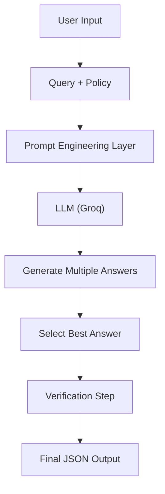

# 📦 Amazon Customer Support AI


---

## 🚀 Project Overview

An AI-powered customer support system that answers queries **strictly based on policy** using **Prompt Engineering**.

⚠️ No assumptions
❌ No external knowledge
✅ Fully policy-driven AI

---

## ✨ Features

* 📜 Policy-based reasoning (strict compliance)
* 📂 Upload policy via **PDF / TXT**
* 🧠 Structured AI output (Answer + Reason + Confidence)
* 🔐 Dynamic API key support (user input + secrets)
* ⚡ Built using Prompt Engineering (No RAG / No Agents)

---

## 🖥️ UI Preview


---

## 🧠 Architecture Diagram



---

## ⚙️ How It Works

```text
User Query + Policy
        ↓
Understand Policy
        ↓
Reason Internally
        ↓
Generate Answer
        ↓
Verify
        ↓
Return JSON Output
```

---

## 📌 Example

### Input:

```json
{
  "query": "Can I return opened headphones after 5 days?",
  "policy": "Electronics cannot be returned if opened."
}
```

### Output:

```json
{
  "answer": "Return is not allowed",
  "reason": "Opened electronics cannot be returned",
  "confidence": "high"
}
```

---

## 🛠️ Tech Stack

* 🐍 Python
* 🎨 Streamlit
* 🔗 LangChain
* ⚡ Groq LLM
* 🧠 Prompt Engineering

---

## ⚙️ Installation

```bash
git clone https://github.com/your-username/amazon-support-ai.git
cd amazon-support-ai

python -m venv venv
venv\Scripts\activate

pip install -r requirements.txt
```

---

## ▶️ Run Locally

```bash
streamlit run app.py
```

---

## 🌐 Deployment

* Streamlit Cloud
* Hugging Face Spaces

---

## 🔐 API Key Handling

* User input (UI)
* Environment variable (`.env`)
* Streamlit Secrets (for deployment)

---

## 🚨 Constraints

* ❌ No RAG
* ❌ No Vector DB
* ❌ No Agents
* ✅ Only Prompt Engineering

---

## 💡 Key Insight

> “There is no fixed correct answer —
> the output depends entirely on the given policy.”

---

## 📁 Project Structure

```bash
amazon-support-ai/
│
├── app.py
├── requirements.txt
├── README.md
├── LICENSE
│
├── utils/
│   └── llm_setup.py
│
├── prompts/
│   └── support_prompt.py
│
├── assets/
│   └── screenshot.png
```

---

## 👨‍💻 Developer

**Tekton AI**

---

## 📜 License

This project is licensed under the MIT License.

---

## ⭐ Support

If you like this project:

👉 Star ⭐ the repo
👉 Share with others
👉 Add to your portfolio
